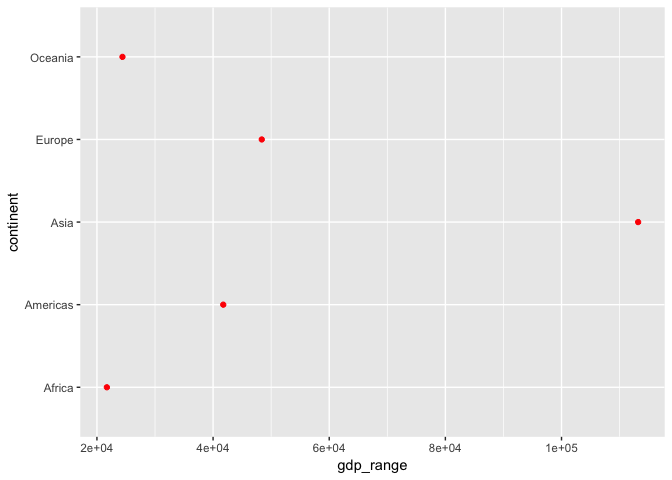
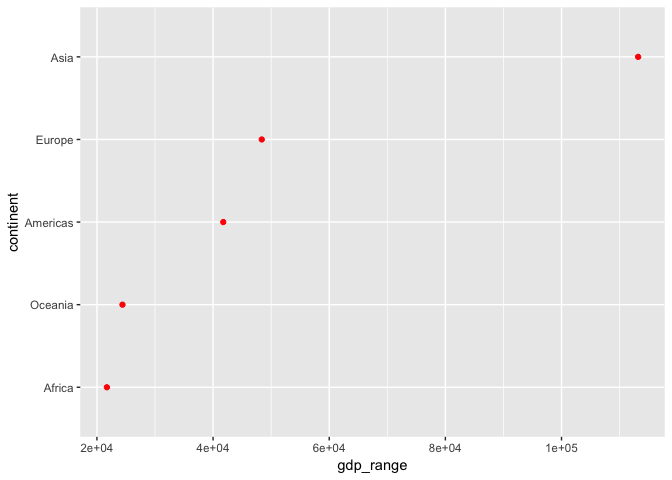
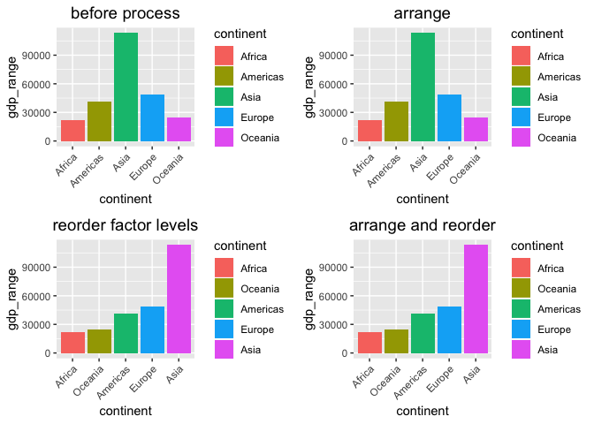
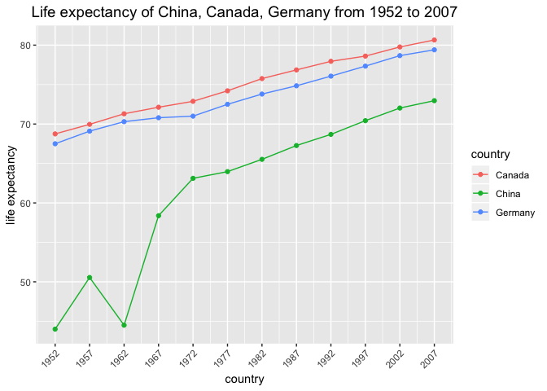

## Goals

 * Factor management 
     * Drop Oceania
     * Reorder the levels of country or continent
  
 * File I/O

 * Visualization design

 * Writing figures to file

Firstly, I need to load packages I am going to use for this assignment.


```r
library(gapminder)
library(tidyverse)
library(knitr)
library(plotly)
library(gridExtra)
```

## Part 1: factor management

### Drop Oceania

**Before Drop Oceania**

Before Dropp Oceania, let's look at levels of continent variable and see how many entries correspond to each continent.


```r
p1<-gapminder$continent 
```


```r
levels(p1) #levels of continent variable
```

```
## [1] "Africa"   "Americas" "Asia"     "Europe"   "Oceania"
```

```r
kable(fct_count(p1),col.names = c('continent','number of entry')) #number of entries for each continent
```


continent    number of entry
----------  ----------------
Africa                   624
Americas                 300
Asia                     396
Europe                   360
Oceania                   24

```r
a<-nlevels(p1) #number of levels
b<-nrow(gapminder) #number of entries after removing oceania
kable(data.frame(number_of_levels = a, number_of_entries = b))
```


 number_of_levels   number_of_entries
-----------------  ------------------
                5                1704

**Drop Oceania**

We need to remove observations associated with the continent of Oceania. Additionally, remove unused factor levels.


```r
p2<-gapminder%>%
  filter(continent != 'Oceania')%>%
  droplevels()
```


**After Drop Oceania**

Now we can look at the level of continent variable and see how many entries correspond to each continent.


```r
p3<-p2$continent
levels(p3) #levels of continent variable
```

```
## [1] "Africa"   "Americas" "Asia"     "Europe"
```

```r
kable(fct_count(p3),col.names = c('continent','number of entry')) #number of entries for each continent
```


continent    number of entry
----------  ----------------
Africa                   624
Americas                 300
Asia                     396
Europe                   360

```r
a<-nlevels(p3) #number of levels
b<-nrow(p2) #number of entries after removing oceania
kable(data.frame(number_of_levels = a, number_of_entries = b))
```


 number_of_levels   number_of_entries
-----------------  ------------------
                4                1680

As expected, the number of rows has dropped by 24, corresponding to the number of observations for Oceania. The number of levels for continent has dropped by 1(Oceania level is dropped).

### Reorder the levels of conitnent

Use the forcats package to change the order of the factor levels, based on a principled summary of one of the quantitative variables. Consider experimenting with a summary statistic beyond the most basic choice of the median.

In this question, I will reorder the data based on gdp range, which is difference between maximum gdpPercap and minimum gdpPercap of each continent.

Firstly, I need to use `group_by()` and `summarize()` functions to calculate gdp range for each continent. 


```r
p4<-group_by(gapminder,continent)%>%
  summarize(gdp_range = max(gdpPercap)-min(gdpPercap))
```


```r
levels(p4$continent)
```

```
## [1] "Africa"   "Americas" "Asia"     "Europe"   "Oceania"
```

```r
kable(p4)
```


continent    gdp_range
----------  ----------
Africa        21710.05
Americas      41750.02
Asia         113192.13
Europe        48383.66
Oceania       24395.77

```r
ggplot(p4,aes(x=gdp_range,y=continent))+
  geom_point(color='red')
```

<!-- -->

Now I want to use `fct_reorder()` function to reorder the factor levels of each continent by their gdp_range variable.


```r
p5<-mutate(p4,continent=fct_reorder(continent,gdp_range))
```


```r
levels(p5$continent)
```

```
## [1] "Africa"   "Oceania"  "Americas" "Europe"   "Asia"
```

```r
kable(p5)
```


continent    gdp_range
----------  ----------
Africa        21710.05
Americas      41750.02
Asia         113192.13
Europe        48383.66
Oceania       24395.77

```r
ggplot(p5,aes(x=gdp_range,y=continent))+
  geom_point(color='red')
```

<!-- -->

According to table, we can find `fct_reorder()` function reorder factor levels of continent and the plot is ordered in the desired way, but it does not rearrange data in the dataframe.  

Next, I will use `arrange()` function to arrange the order of data by their gdp_range variable.


```r
p6<-p4%>%
  arrange(gdp_range)
```


```r
levels(p6$continent)
```

```
## [1] "Africa"   "Americas" "Asia"     "Europe"   "Oceania"
```

```r
kable(p6)
```


continent    gdp_range
----------  ----------
Africa        21710.05
Oceania       24395.77
Americas      41750.02
Europe        48383.66
Asia         113192.13

```r
ggplot(p6,aes(x=gdp_range,y=continent))+
  geom_point(color='red')
```

<!-- -->

Obviously, `arrange()` function arranges the data in an increading order of gdp_range variable, but it does not change the factor levels of contiennt. 

Now we can combine `arrange()` and `fct_reorder` to see what happens. 


```r
p7<-p4%>%
  arrange(gdp_range)%>%
  mutate(continent=fct_reorder(continent,gdp_range))
```


```r
levels(p7$continent)
```

```
## [1] "Africa"   "Oceania"  "Americas" "Europe"   "Asia"
```

```r
kable(p7)
```


continent    gdp_range
----------  ----------
Africa        21710.05
Oceania       24395.77
Americas      41750.02
Europe        48383.66
Asia         113192.13

```r
ggplot(p7,aes(x=gdp_range,y=continent))+
  geom_point(color='red')
```

<!-- -->

We can find that both table and plot are ordered in the desired way. 

Conclusion:

 * `fct_reorder()` function changes factor levels of continent but it does not rearrange data in the dataframe. It has an effect on how variables are organized on plots.  
 * `arrange()` function arranges the data in an increading order of gdp_range variable, but it does not change the factor levels of contiennt. 
So the how variables are organized on plots are not affected by `arrange()` function. 
* combining `fct_reorder()` and `arrange()` can both changes factor levels of continent and arranges the data in an increading order of gdp_range variable. 

## Part 2: File I/O

#### Explore `write_csv()` and `read_csv` function

I'm going to try writing the re-ordered dataframe to a csv file and then 
reload it. 


```r
re_order <- group_by(gapminder,continent)%>%
            summarize(gdp_range = max(gdpPercap)-min(gdpPercap))%>%
            mutate(continent=fct_reorder(continent,gdp_range))
str(re_order) # look at the structure of re-ordered dataframe
```

```
## Classes 'tbl_df', 'tbl' and 'data.frame':	5 obs. of  2 variables:
##  $ continent: Factor w/ 5 levels "Africa","Oceania",..: 1 3 5 4 2
##  $ gdp_range: num  21710 41750 113192 48384 24396
```

```r
levels(re_order$continent) # look at the levels of continent variable
```

```
## [1] "Africa"   "Oceania"  "Americas" "Europe"   "Asia"
```

Write and reload .csv files. 

```r
write_csv(re_order,"a1.csv") 
data<-read_csv("a1.csv")
```

```
## Parsed with column specification:
## cols(
##   continent = col_character(),
##   gdp_range = col_double()
## )
```

Look at the structure of reloaded dataframe. 

```r
str(data)
```

```
## Classes 'tbl_df', 'tbl' and 'data.frame':	5 obs. of  2 variables:
##  $ continent: chr  "Africa" "Americas" "Asia" "Europe" ...
##  $ gdp_range: num  21710 41750 113192 48384 24396
##  - attr(*, "spec")=List of 2
##   ..$ cols   :List of 2
##   .. ..$ continent: list()
##   .. .. ..- attr(*, "class")= chr  "collector_character" "collector"
##   .. ..$ gdp_range: list()
##   .. .. ..- attr(*, "class")= chr  "collector_double" "collector"
##   ..$ default: list()
##   .. ..- attr(*, "class")= chr  "collector_guess" "collector"
##   ..- attr(*, "class")= chr "col_spec"
```

Obviously, the continent variable is not a factor but a list. So `write_csv()\read_csv()` changes the the attributes of factor variable in dataframe. 

#### Explore `saveRDS()` and `readRDS()`

Now let's save re-ordered dataframe to a file and reopen it again, this time using saveRDS()/readRDS().


```r
str(re_order)
```

```
## Classes 'tbl_df', 'tbl' and 'data.frame':	5 obs. of  2 variables:
##  $ continent: Factor w/ 5 levels "Africa","Oceania",..: 1 3 5 4 2
##  $ gdp_range: num  21710 41750 113192 48384 24396
```

```r
levels(re_order$continent)
```

```
## [1] "Africa"   "Oceania"  "Americas" "Europe"   "Asia"
```

Write and reload .rds files.


```r
saveRDS(re_order,"a2.rds")
data<-readRDS("a2.rds")
```

Look at the structure of reloaded dataframe. 


```r
str(data)
```

```
## Classes 'tbl_df', 'tbl' and 'data.frame':	5 obs. of  2 variables:
##  $ continent: Factor w/ 5 levels "Africa","Oceania",..: 1 3 5 4 2
##  $ gdp_range: num  21710 41750 113192 48384 24396
```

```r
levels(data$continent)
```

```
## [1] "Africa"   "Oceania"  "Americas" "Europe"   "Asia"
```

The dataframes are completely identical. Functions `saveRDS()/readRDS()` preserved the order of the factor continent, unlike `write_csv()\read_csv()`.

#### Explore `dput()` and `dget()`

Look at the structure of re-ordered dataframe and levels of continent variables. 


```r
str(re_order)
```

```
## Classes 'tbl_df', 'tbl' and 'data.frame':	5 obs. of  2 variables:
##  $ continent: Factor w/ 5 levels "Africa","Oceania",..: 1 3 5 4 2
##  $ gdp_range: num  21710 41750 113192 48384 24396
```

```r
levels(re_order$continent)
```

```
## [1] "Africa"   "Oceania"  "Americas" "Europe"   "Asia"
```

Write and reload .R files.


```r
dput(re_order,"a3.R")
data<-dget("a3.R")
```

Look at the structure of reloaded dataframe. 


```r
str(data)
```

```
## Classes 'tbl_df', 'tbl' and 'data.frame':	5 obs. of  2 variables:
##  $ continent: Factor w/ 5 levels "Africa","Oceania",..: 1 3 5 4 2
##  $ gdp_range: num  21710 41750 113192 48384 24396
```

```r
levels(data$continent)
```

```
## [1] "Africa"   "Oceania"  "Americas" "Europe"   "Asia"
```

We can see that dataframe before saving is the same as that after loading, so `dput()\dget()` does not destroy any information in dataframe. 

## Part 3: Visualization design

In part I, I use scatter plots to show difference of `arrange()` and `fct_reorder` function. In this part, I will use bar plots to visulize gdp range (difference between maximum gdp per capita and minimum gdp per capita) in different continents. 


```r
# group and summarize gdp range data in different continents
p8 <- group_by(gapminder,continent)%>%
      summarize(gdp_range = max(gdpPercap)-min(gdpPercap))

# bar plot for original data
pl1<-ggplot(p8,aes(x=continent,y=gdp_range))+
     geom_bar(aes(fill=continent),stat="identity",position="dodge")+
     theme(plot.title = element_text(size=14,hjust=0.5),
           axis.text.x = element_text(angle = 45, hjust = 1))+
     labs(x="continent",
          y="gdp_range",
          title="before process")

# arrange gap_range in an increasing order
p9 <- arrange(p8,gdp_range)
# bar plot for arranged data
pl2<-ggplot(p9,aes(x=continent,y=gdp_range))+
     geom_bar(aes(fill=continent),stat="identity",position="dodge")+
     theme(plot.title = element_text(size=14,hjust=0.5),
           axis.text.x = element_text(angle = 45, hjust = 1))+
     labs(x="continent",
          y="gdp_range",
          title="arrange")

# re-order factor levels of continent variable
p10 <- mutate(p8,continent = fct_reorder(continent, gdp_range))
# bar plot for re-ordered data
pl3<-ggplot(p10,aes(x=continent,y=gdp_range))+
     geom_bar(aes(fill=continent),stat="identity",position="dodge")+
     theme(plot.title = element_text(size=14,hjust=0.5),
           axis.text.x = element_text(angle = 45, hjust = 1))+
     labs(x="continent",
          y="gdp_range",
          title="reorder factor levels")

# combine arrange and re-order 
p11<-arrange(p8,gdp_range)%>%
     mutate(continent = fct_reorder(continent, gdp_range))
# bar plot for arrange and fct_reorder
pl4<-ggplot(p11,aes(x=continent,y=gdp_range))+
     geom_bar(aes(fill=continent),stat="identity",position="dodge")+
     theme(plot.title = element_text(size=14,hjust=0.5),
           axis.text.x = element_text(angle = 45, hjust = 1))+
     labs(x="continent",
          y="gdp_range",
          title="arrange and reorder")

# show 4 plots in one page
grid.arrange(pl1,pl2,pl3,pl4,nrow=2)
```

<!-- -->

Next, I will compare the difference of ggplot2 graph and plotly graph.

First, I will make a scatterplot to compare life expectanct of China, Canada and Germany using ggplot2.


```r
p12<-filter(gapminder, country %in% c('China','Germany','Canada'))%>%
  select(year,country,lifeExp)
(pl5<-ggplot(p12,aes(x=year,y=lifeExp,color=country))+
      geom_point()+
      geom_line()+
      scale_x_continuous(limits=c(1952,2007),breaks=seq(1952,2007,5))+
      theme(axis.text.x = element_text(angle = 45, hjust = 1),
           plot.title = element_text(size=14,hjust=0.5))+
      labs(x="country",
           y="life expectancy",
           title="Life expectancy of China, Canada, Germany from 1952 to 2007"))
```

<!-- -->

Now I will convert it into plotly graph.


```r
ggplotly(pl5)
```

<!--html_preserve--><div id="htmlwidget-5d080a6404be7822fb60" style="width:672px;height:480px;" class="plotly html-widget"></div>
<script type="application/json" data-for="htmlwidget-5d080a6404be7822fb60">{"x":{"data":[{"x":[1952,1957,1962,1967,1972,1977,1982,1987,1992,1997,2002,2007],"y":[68.75,69.96,71.3,72.13,72.88,74.21,75.76,76.86,77.95,78.61,79.77,80.653],"text":["year: 1952<br />lifeExp: 68.75000<br />country: Canada","year: 1957<br />lifeExp: 69.96000<br />country: Canada","year: 1962<br />lifeExp: 71.30000<br />country: Canada","year: 1967<br />lifeExp: 72.13000<br />country: Canada","year: 1972<br />lifeExp: 72.88000<br />country: Canada","year: 1977<br />lifeExp: 74.21000<br />country: Canada","year: 1982<br />lifeExp: 75.76000<br />country: Canada","year: 1987<br />lifeExp: 76.86000<br />country: Canada","year: 1992<br />lifeExp: 77.95000<br />country: Canada","year: 1997<br />lifeExp: 78.61000<br />country: Canada","year: 2002<br />lifeExp: 79.77000<br />country: Canada","year: 2007<br />lifeExp: 80.65300<br />country: Canada"],"type":"scatter","mode":"markers+lines","marker":{"autocolorscale":false,"color":"rgba(248,118,109,1)","opacity":1,"size":5.66929133858268,"symbol":"circle","line":{"width":1.88976377952756,"color":"rgba(248,118,109,1)"}},"hoveron":"points","name":"Canada","legendgroup":"Canada","showlegend":true,"xaxis":"x","yaxis":"y","hoverinfo":"text","line":{"width":1.88976377952756,"color":"rgba(248,118,109,1)","dash":"solid"},"frame":null},{"x":[1952,1957,1962,1967,1972,1977,1982,1987,1992,1997,2002,2007],"y":[44,50.54896,44.50136,58.38112,63.11888,63.96736,65.525,67.274,68.69,70.426,72.028,72.961],"text":["year: 1952<br />lifeExp: 44.00000<br />country: China","year: 1957<br />lifeExp: 50.54896<br />country: China","year: 1962<br />lifeExp: 44.50136<br />country: China","year: 1967<br />lifeExp: 58.38112<br />country: China","year: 1972<br />lifeExp: 63.11888<br />country: China","year: 1977<br />lifeExp: 63.96736<br />country: China","year: 1982<br />lifeExp: 65.52500<br />country: China","year: 1987<br />lifeExp: 67.27400<br />country: China","year: 1992<br />lifeExp: 68.69000<br />country: China","year: 1997<br />lifeExp: 70.42600<br />country: China","year: 2002<br />lifeExp: 72.02800<br />country: China","year: 2007<br />lifeExp: 72.96100<br />country: China"],"type":"scatter","mode":"markers+lines","marker":{"autocolorscale":false,"color":"rgba(0,186,56,1)","opacity":1,"size":5.66929133858268,"symbol":"circle","line":{"width":1.88976377952756,"color":"rgba(0,186,56,1)"}},"hoveron":"points","name":"China","legendgroup":"China","showlegend":true,"xaxis":"x","yaxis":"y","hoverinfo":"text","line":{"width":1.88976377952756,"color":"rgba(0,186,56,1)","dash":"solid"},"frame":null},{"x":[1952,1957,1962,1967,1972,1977,1982,1987,1992,1997,2002,2007],"y":[67.5,69.1,70.3,70.8,71,72.5,73.8,74.847,76.07,77.34,78.67,79.406],"text":["year: 1952<br />lifeExp: 67.50000<br />country: Germany","year: 1957<br />lifeExp: 69.10000<br />country: Germany","year: 1962<br />lifeExp: 70.30000<br />country: Germany","year: 1967<br />lifeExp: 70.80000<br />country: Germany","year: 1972<br />lifeExp: 71.00000<br />country: Germany","year: 1977<br />lifeExp: 72.50000<br />country: Germany","year: 1982<br />lifeExp: 73.80000<br />country: Germany","year: 1987<br />lifeExp: 74.84700<br />country: Germany","year: 1992<br />lifeExp: 76.07000<br />country: Germany","year: 1997<br />lifeExp: 77.34000<br />country: Germany","year: 2002<br />lifeExp: 78.67000<br />country: Germany","year: 2007<br />lifeExp: 79.40600<br />country: Germany"],"type":"scatter","mode":"markers+lines","marker":{"autocolorscale":false,"color":"rgba(97,156,255,1)","opacity":1,"size":5.66929133858268,"symbol":"circle","line":{"width":1.88976377952756,"color":"rgba(97,156,255,1)"}},"hoveron":"points","name":"Germany","legendgroup":"Germany","showlegend":true,"xaxis":"x","yaxis":"y","hoverinfo":"text","line":{"width":1.88976377952756,"color":"rgba(97,156,255,1)","dash":"solid"},"frame":null}],"layout":{"margin":{"t":44.8252386882524,"r":7.30593607305936,"b":42.2242855402004,"l":37.2602739726027},"plot_bgcolor":"rgba(235,235,235,1)","paper_bgcolor":"rgba(255,255,255,1)","font":{"color":"rgba(0,0,0,1)","family":"","size":14.6118721461187},"title":"Life expectancy of China, Canada, Germany from 1952 to 2007","titlefont":{"color":"rgba(0,0,0,1)","family":"","size":18.5969281859693},"xaxis":{"domain":[0,1],"automargin":true,"type":"linear","autorange":false,"range":[1949.25,2009.75],"tickmode":"array","ticktext":["1952","1957","1962","1967","1972","1977","1982","1987","1992","1997","2002","2007"],"tickvals":[1952,1957,1962,1967,1972,1977,1982,1987,1992,1997,2002,2007],"categoryorder":"array","categoryarray":["1952","1957","1962","1967","1972","1977","1982","1987","1992","1997","2002","2007"],"nticks":null,"ticks":"outside","tickcolor":"rgba(51,51,51,1)","ticklen":3.65296803652968,"tickwidth":0.66417600664176,"showticklabels":true,"tickfont":{"color":"rgba(77,77,77,1)","family":"","size":11.689497716895},"tickangle":-45,"showline":false,"linecolor":null,"linewidth":0,"showgrid":true,"gridcolor":"rgba(255,255,255,1)","gridwidth":0.66417600664176,"zeroline":false,"anchor":"y","title":"country","titlefont":{"color":"rgba(0,0,0,1)","family":"","size":14.6118721461187},"hoverformat":".2f"},"yaxis":{"domain":[0,1],"automargin":true,"type":"linear","autorange":false,"range":[42.16735,82.48565],"tickmode":"array","ticktext":["50","60","70","80"],"tickvals":[50,60,70,80],"categoryorder":"array","categoryarray":["50","60","70","80"],"nticks":null,"ticks":"outside","tickcolor":"rgba(51,51,51,1)","ticklen":3.65296803652968,"tickwidth":0.66417600664176,"showticklabels":true,"tickfont":{"color":"rgba(77,77,77,1)","family":"","size":11.689497716895},"tickangle":-0,"showline":false,"linecolor":null,"linewidth":0,"showgrid":true,"gridcolor":"rgba(255,255,255,1)","gridwidth":0.66417600664176,"zeroline":false,"anchor":"x","title":"life expectancy","titlefont":{"color":"rgba(0,0,0,1)","family":"","size":14.6118721461187},"hoverformat":".2f"},"shapes":[{"type":"rect","fillcolor":null,"line":{"color":null,"width":0,"linetype":[]},"yref":"paper","xref":"paper","x0":0,"x1":1,"y0":0,"y1":1}],"showlegend":true,"legend":{"bgcolor":"rgba(255,255,255,1)","bordercolor":"transparent","borderwidth":1.88976377952756,"font":{"color":"rgba(0,0,0,1)","family":"","size":11.689497716895},"y":0.913385826771654},"annotations":[{"text":"country","x":1.02,"y":1,"showarrow":false,"ax":0,"ay":0,"font":{"color":"rgba(0,0,0,1)","family":"","size":14.6118721461187},"xref":"paper","yref":"paper","textangle":-0,"xanchor":"left","yanchor":"bottom","legendTitle":true}],"hovermode":"closest","barmode":"relative"},"config":{"doubleClick":"reset","modeBarButtonsToAdd":[{"name":"Collaborate","icon":{"width":1000,"ascent":500,"descent":-50,"path":"M487 375c7-10 9-23 5-36l-79-259c-3-12-11-23-22-31-11-8-22-12-35-12l-263 0c-15 0-29 5-43 15-13 10-23 23-28 37-5 13-5 25-1 37 0 0 0 3 1 7 1 5 1 8 1 11 0 2 0 4-1 6 0 3-1 5-1 6 1 2 2 4 3 6 1 2 2 4 4 6 2 3 4 5 5 7 5 7 9 16 13 26 4 10 7 19 9 26 0 2 0 5 0 9-1 4-1 6 0 8 0 2 2 5 4 8 3 3 5 5 5 7 4 6 8 15 12 26 4 11 7 19 7 26 1 1 0 4 0 9-1 4-1 7 0 8 1 2 3 5 6 8 4 4 6 6 6 7 4 5 8 13 13 24 4 11 7 20 7 28 1 1 0 4 0 7-1 3-1 6-1 7 0 2 1 4 3 6 1 1 3 4 5 6 2 3 3 5 5 6 1 2 3 5 4 9 2 3 3 7 5 10 1 3 2 6 4 10 2 4 4 7 6 9 2 3 4 5 7 7 3 2 7 3 11 3 3 0 8 0 13-1l0-1c7 2 12 2 14 2l218 0c14 0 25-5 32-16 8-10 10-23 6-37l-79-259c-7-22-13-37-20-43-7-7-19-10-37-10l-248 0c-5 0-9-2-11-5-2-3-2-7 0-12 4-13 18-20 41-20l264 0c5 0 10 2 16 5 5 3 8 6 10 11l85 282c2 5 2 10 2 17 7-3 13-7 17-13z m-304 0c-1-3-1-5 0-7 1-1 3-2 6-2l174 0c2 0 4 1 7 2 2 2 4 4 5 7l6 18c0 3 0 5-1 7-1 1-3 2-6 2l-173 0c-3 0-5-1-8-2-2-2-4-4-4-7z m-24-73c-1-3-1-5 0-7 2-2 3-2 6-2l174 0c2 0 5 0 7 2 3 2 4 4 5 7l6 18c1 2 0 5-1 6-1 2-3 3-5 3l-174 0c-3 0-5-1-7-3-3-1-4-4-5-6z"},"click":"function(gd) { \n        // is this being viewed in RStudio?\n        if (location.search == '?viewer_pane=1') {\n          alert('To learn about plotly for collaboration, visit:\\n https://cpsievert.github.io/plotly_book/plot-ly-for-collaboration.html');\n        } else {\n          window.open('https://cpsievert.github.io/plotly_book/plot-ly-for-collaboration.html', '_blank');\n        }\n      }"}],"cloud":false},"source":"A","attrs":{"65f92fd4fa39":{"x":{},"y":{},"colour":{},"type":"scatter"},"65f94777ccb7":{"x":{},"y":{},"colour":{}}},"cur_data":"65f92fd4fa39","visdat":{"65f92fd4fa39":["function (y) ","x"],"65f94777ccb7":["function (y) ","x"]},"highlight":{"on":"plotly_click","persistent":false,"dynamic":false,"selectize":false,"opacityDim":0.2,"selected":{"opacity":1},"debounce":0},"base_url":"https://plot.ly"},"evals":["config.modeBarButtonsToAdd.0.click"],"jsHooks":[]}</script><!--/html_preserve-->

Also, I want to make 3D plot of above plot using `plot_ly()`.


```r
plot_ly(p12,
        x=~year,
        y=~lifeExp,
        z=~country,
        type='scatter3d',
        mode='markers')
```

<!--html_preserve--><div id="htmlwidget-3c4f958b2ae857b331e6" style="width:672px;height:480px;" class="plotly html-widget"></div>
<script type="application/json" data-for="htmlwidget-3c4f958b2ae857b331e6">{"x":{"visdat":{"65f95f472d01":["function () ","plotlyVisDat"]},"cur_data":"65f95f472d01","attrs":{"65f95f472d01":{"x":{},"y":{},"z":{},"mode":"markers","alpha_stroke":1,"sizes":[10,100],"spans":[1,20],"type":"scatter3d"}},"layout":{"margin":{"b":40,"l":60,"t":25,"r":10},"scene":{"xaxis":{"title":"year"},"yaxis":{"title":"lifeExp"},"zaxis":{"title":"country"}},"hovermode":"closest","showlegend":false},"source":"A","config":{"modeBarButtonsToAdd":[{"name":"Collaborate","icon":{"width":1000,"ascent":500,"descent":-50,"path":"M487 375c7-10 9-23 5-36l-79-259c-3-12-11-23-22-31-11-8-22-12-35-12l-263 0c-15 0-29 5-43 15-13 10-23 23-28 37-5 13-5 25-1 37 0 0 0 3 1 7 1 5 1 8 1 11 0 2 0 4-1 6 0 3-1 5-1 6 1 2 2 4 3 6 1 2 2 4 4 6 2 3 4 5 5 7 5 7 9 16 13 26 4 10 7 19 9 26 0 2 0 5 0 9-1 4-1 6 0 8 0 2 2 5 4 8 3 3 5 5 5 7 4 6 8 15 12 26 4 11 7 19 7 26 1 1 0 4 0 9-1 4-1 7 0 8 1 2 3 5 6 8 4 4 6 6 6 7 4 5 8 13 13 24 4 11 7 20 7 28 1 1 0 4 0 7-1 3-1 6-1 7 0 2 1 4 3 6 1 1 3 4 5 6 2 3 3 5 5 6 1 2 3 5 4 9 2 3 3 7 5 10 1 3 2 6 4 10 2 4 4 7 6 9 2 3 4 5 7 7 3 2 7 3 11 3 3 0 8 0 13-1l0-1c7 2 12 2 14 2l218 0c14 0 25-5 32-16 8-10 10-23 6-37l-79-259c-7-22-13-37-20-43-7-7-19-10-37-10l-248 0c-5 0-9-2-11-5-2-3-2-7 0-12 4-13 18-20 41-20l264 0c5 0 10 2 16 5 5 3 8 6 10 11l85 282c2 5 2 10 2 17 7-3 13-7 17-13z m-304 0c-1-3-1-5 0-7 1-1 3-2 6-2l174 0c2 0 4 1 7 2 2 2 4 4 5 7l6 18c0 3 0 5-1 7-1 1-3 2-6 2l-173 0c-3 0-5-1-8-2-2-2-4-4-4-7z m-24-73c-1-3-1-5 0-7 2-2 3-2 6-2l174 0c2 0 5 0 7 2 3 2 4 4 5 7l6 18c1 2 0 5-1 6-1 2-3 3-5 3l-174 0c-3 0-5-1-7-3-3-1-4-4-5-6z"},"click":"function(gd) { \n        // is this being viewed in RStudio?\n        if (location.search == '?viewer_pane=1') {\n          alert('To learn about plotly for collaboration, visit:\\n https://cpsievert.github.io/plotly_book/plot-ly-for-collaboration.html');\n        } else {\n          window.open('https://cpsievert.github.io/plotly_book/plot-ly-for-collaboration.html', '_blank');\n        }\n      }"}],"cloud":false},"data":[{"x":[1952,1957,1962,1967,1972,1977,1982,1987,1992,1997,2002,2007,1952,1957,1962,1967,1972,1977,1982,1987,1992,1997,2002,2007,1952,1957,1962,1967,1972,1977,1982,1987,1992,1997,2002,2007],"y":[68.75,69.96,71.3,72.13,72.88,74.21,75.76,76.86,77.95,78.61,79.77,80.653,44,50.54896,44.50136,58.38112,63.11888,63.96736,65.525,67.274,68.69,70.426,72.028,72.961,67.5,69.1,70.3,70.8,71,72.5,73.8,74.847,76.07,77.34,78.67,79.406],"z":["Canada","Canada","Canada","Canada","Canada","Canada","Canada","Canada","Canada","Canada","Canada","Canada","China","China","China","China","China","China","China","China","China","China","China","China","Germany","Germany","Germany","Germany","Germany","Germany","Germany","Germany","Germany","Germany","Germany","Germany"],"mode":"markers","type":"scatter3d","marker":{"color":"rgba(31,119,180,1)","line":{"color":"rgba(31,119,180,1)"}},"error_y":{"color":"rgba(31,119,180,1)"},"error_x":{"color":"rgba(31,119,180,1)"},"line":{"color":"rgba(31,119,180,1)"},"frame":null}],"highlight":{"on":"plotly_click","persistent":false,"dynamic":false,"selectize":false,"opacityDim":0.2,"selected":{"opacity":1},"debounce":0},"base_url":"https://plot.ly"},"evals":["config.modeBarButtonsToAdd.0.click"],"jsHooks":[]}</script><!--/html_preserve-->

`plotly` is amazing! It allows people to quickly create beautiful, reactive D3 plots that are particularly powerful in websites and dashboards. we can also hover our mouse over the plots and see the data values, zoom in and out of specific regions, and capture stills.

## Part 4: Writing figures to file 

Firstly, I will use density plot to visualize the distribution of GDP per capita for each continent from year 1952 to 2007 and then save it as an PNG image.


```r
# plot1
plot1<-ggplot(gapminder,aes(x=gdpPercap))+
  geom_density(color='red')+
  facet_wrap(~continent)+
  scale_x_continuous(breaks = seq(0, 120000, 20000),
                     labels = as.character(seq(0, 120000, 20000)),
                     limits = c(0,120000))+
  theme(axis.text.x = element_text(angle = 45, hjust = 1),
        plot.title = element_text(size=14,hjust=0.5))+
  labs(x="GDP per capita",
       y="density",
       title="Distribution of GDP per capita for each continent from 1952 to 2007")
# save plot1 as an PNG image
ggsave("plot1.png",
       plot=plot1,
       width = 10, 
       height = 7,
       scale = 1.2)
```

Then I will load and embed it in my report.


Secondly, I will use histogram plot to visualize the distribution of GDP per capita for each continent and then save this as a PDF image. 


```r
# plot2
plot2 <- filter(gapminder,year %in% c(1952,2007))%>%
  ggplot(aes(x=gdpPercap))+
  geom_histogram(fill='blue',alpha=0.3,bins=45)+
  facet_grid(continent~year)+
  scale_x_continuous(breaks = seq(0, 60000, 10000),
                     labels = as.character(seq(0, 60000, 10000)),
                     limits = c(0,60000))+
  theme(axis.text.x = element_text(angle = 45, hjust = 1),
        plot.title = element_text(size=14,hjust=0.5))+
  labs(x="GDP per capita",
       y="number of countries",
       title="Distribution of GDP per capita for each continent in 1952 and 2007")
# save plot2 as a pdf image
ggsave("plot2.pdf",
       plot=plot2,
       width = 10, 
       height = 7,
       scale = 1.2)
```

```
## Warning: Removed 1 rows containing non-finite values (stat_bin).
```

Then I will load and embed it in my report.


